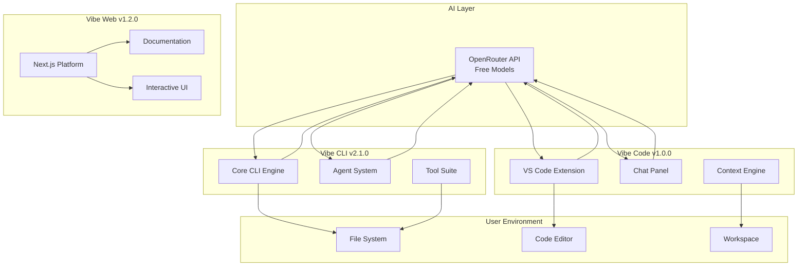

# Vibe Repository — AI-Powered Development Ecosystem

**Version: 2.0.0** | **Status: Production Ready** | **License: MIT**

A comprehensive AI-powered development ecosystem consisting of three integrated packages designed to enhance your coding workflow across terminal, web, and IDE environments.

## 🚀 Ecosystem Components

1. **Vibe CLI** (v2.1.0) — Advanced terminal assistant with chat, code generation, refactoring, debugging, testing, git automation, and autonomous agent capabilities
2. **Vibe Web** (v1.2.0) — Modern marketing and documentation platform built with Next.js 16, featuring interactive guides and comprehensive onboarding
3. **Vibe Code** (v1.0.0) — Feature-rich VS Code extension providing in-editor AI assistance with multiple modes and personas

Each package maintains independent versioning and release cycles while sharing a unified design philosophy and OpenRouter integration for free AI model access.

## 🎯 Key Features

### 🤖 AI-Powered Assistance
- **Free Model Access**: Integration with OpenRouter's free tier models
- **Task-Specific Models**: Intelligent model selection based on task type
- **Privacy-First**: No data retention, local-first approach
- **Multi-Modal Support**: Text, code, and context-aware interactions

### 🛠️ Comprehensive Toolset
- **Code Generation**: Create entire applications from natural language descriptions
- **Intelligent Refactoring**: Automated code improvements with safety checks
- **Debugging Assistant**: Error analysis and resolution suggestions
- **Test Generation**: Automated test suite creation
- **Git Automation**: Smart commit messages and code reviews
- **Agent Mode**: Autonomous multi-step task execution

### 🌐 Multi-Platform Support
- **Terminal Native**: Full-featured CLI for power users
- **Web Interface**: Modern documentation and onboarding platform
- **IDE Integration**: Seamless VS Code extension with rich UI

## 📦 Quick Installation

### Vibe CLI (Terminal)
```bash
# Multiple Installation Methods

# NPM (Cross-Platform)
npm install -g vibe-ai-cli

# Homebrew (macOS/Linux)
brew install mk-knight23/tap/vibe-ai-cli

# Chocolatey (Windows)
choco install vibe-ai-cli

# Scoop (Windows)
scoop bucket add vibe https://github.com/mk-knight23/scoop-manifest
scoop install vibe-ai-cli

# Direct Binary
# Download from GitHub Releases: https://github.com/mk-knight23/vibe/releases
```

Usage:
```bash
vibe chat "Hello, Vibe!"
```

### Vibe Code (VS Code)
```bash
# Install from VS Code Marketplace
# Search for "Vibe VS Code" by mk-knight23
# Or install from VSIX:
cd vibe-code && npm run package && code --install-extension vibe-vscode-*.vsix
```

### Vibe Web (Documentation)
```bash
cd vibe-web
npm install && npm run dev
# Visit http://localhost:3000
```

## 🔗 Quick Links
- **Versioning Strategy**: [`VERSIONING.md`](VERSIONING.md:1)
- **Publishing Guide**: [`PUBLISHING.md`](PUBLISHING.md:1)
- **CLI Documentation**: [`vibe-cli/README.md`](vibe-cli/README.md:1)
- **Web Documentation**: [`vibe-web/README.md`](vibe-web/README.md:1)
- **Extension Guide**: [`vibe-code/readme.md`](vibe-code/readme.md:1)

---

## 🏗️ Architecture Overview



### 🔄 Data Flow Architecture

1. **AI Integration Layer**: Centralized OpenRouter API access with intelligent model selection
2. **CLI Processing**: Terminal-based interactions with file system operations
3. **Web Platform**: Static documentation and interactive guides
4. **Extension Integration**: In-editor assistance with workspace context
5. **Security Layer**: Privacy-first design with local data processing

### 🎯 Design Principles

- **Modularity**: Independent packages with unified API contracts
- **Privacy-First**: Local processing with optional cloud AI features
- **Extensibility**: Plugin architecture for custom tools and integrations
- **Performance**: Optimized for minimal resource usage and fast responses


## 📁 Repository Structure

```
vibe-ecosystem/
├── 📄 package.json              # Meta repository manifest
├── 📄 LICENSE                   # MIT License
├── 📄 README.md                 # This file - ecosystem overview
├── 📄 VERSIONING.md             # Version management strategy
├── 📄 PUBLISHING.md             # Publishing guidelines
│
├── 📂 vibe-cli/                 # Terminal Assistant (v2.1.0)
│   ├── 📄 package.json
│   ├── 📄 cli.cjs               # Interactive REPL engine
│   ├── 📄 tools.cjs              # Utility functions
│   ├── 📂 bin/
│   │   └── 📄 vibe.cjs          # CLI entry point
│   ├── 📂 core/                  # Core functionality
│   │   ├── 📄 apikey.ts/.cjs     # API key management
│   │   ├── 📄 openrouter.ts/.cjs # AI model integration
│   │   └── 📄 index.cjs          # Core exports
│   ├── 📂 agent/                 # Autonomous agent system
│   ├── 📂 code/                  # Code generation tools
│   ├── 📂 edit/                  # Multi-file editing
│   ├── 📂 git/                   # Git integration
│   ├── 📂 refactor/              # Code refactoring
│   ├── 📂 debug/                 # Debugging utilities
│   └── 📂 test/                  # Test generation
│
├── 📂 vibe-web/                 # Web Platform (v1.2.0)
│   ├── 📄 package.json
│   ├── 📄 next.config.mjs        # Next.js configuration
│   ├── 📄 tailwind.config.cjs    # Styling configuration
│   ├── 📂 src/
│   │   ├── 📂 app/               # App Router pages
│   │   │   ├── 📄 page.tsx       # Landing page
│   │   │   ├── 📂 commands/      # CLI documentation
│   │   │   ├── 📂 installation/  # Setup guides
│   │   │   └── 📂 quick-start/   # Getting started
│   │   ├── 📂 components/         # React components
│   │   │   ├── 📂 ui/            # Base UI components
│   │   │   ├── 📂 marketing/     # Marketing sections
│   │   │   └── 📄 layout.tsx     # App layout
│   │   ├── 📂 hooks/              # Custom React hooks
│   │   └── 📂 lib/               # Utilities and helpers
│   └── 📂 public/                # Static assets
│
└── 📂 vibe-code/                 # VS Code Extension (v1.0.0)
    ├── 📄 package.json
    ├── 📄 tsconfig.json
    ├── 📂 src/
    │   ├── 📄 extension.ts        # Main extension logic
    │   └── 📂 media/              # Extension assets
    ├── 📂 .vscode/               # VS Code configuration
    └── 📄 README.md              # Extension documentation
```

---

## 🎯 Package Overview

| Package | Version | Purpose | Distribution | Entry Point |
|---------|---------|---------|--------------|-------------|
| **Vibe CLI** | v2.1.0 | Terminal-based AI assistant | npm Registry | [`vibe-cli/bin/vibe.cjs`](vibe-cli/bin/vibe.cjs:1) |
| **Vibe Web** | v1.2.0 | Documentation & marketing platform | Vercel/Static Hosting | [`vibe-web/src/app/page.tsx`](vibe-web/src/app/page.tsx:1) |
| **Vibe Code** | v1.0.0 | VS Code extension with AI integration | VS Code Marketplace | [`vibe-code/src/extension.ts`](vibe-code/src/extension.ts:1) |

### 🚀 Key Capabilities by Package

#### Vibe CLI (v2.1.0) - Terminal Powerhouse
- **Interactive Chat**: Natural language conversations with AI
- **Code Generation**: Create entire projects from descriptions
- **Intelligent Refactoring**: Automated code improvements
- **Debug Assistant**: Error analysis and resolution
- **Test Generation**: Automated test suite creation
- **Git Automation**: Smart commits and code reviews
- **Agent Mode**: Autonomous multi-step task execution

#### Vibe Web (v1.2.0) - Modern Web Platform
- **Interactive Documentation**: Comprehensive guides and tutorials
- **Feature Showcase**: Live demonstrations of capabilities
- **Installation Guides**: Step-by-step setup instructions
- **Responsive Design**: Mobile-first, accessible interface
- **Performance Optimized**: Fast loading with Next.js 16

#### Vibe Code (v1.0.0) - IDE Integration
- **In-Editor Chat**: AI assistance without leaving your code
- **Multiple Modes**: Specialized personas for different tasks
- **Context Awareness**: Understands your project structure
- **Keyboard Shortcuts**: Quick mode switching and actions
- **Diff Preview**: Safe code modifications with review

---

## 🚀 Getting Started

### 🖥️ Vibe CLI - Terminal Assistant

#### Installation
```bash
# Multiple Installation Methods

# NPM (Cross-Platform)
npm install -g vibe-ai-cli

# Homebrew (macOS/Linux)
brew tap mk-knight23/tap
brew install vibe-ai-cli

# Chocolatey (Windows)
choco install vibe-ai-cli

# Scoop (Windows)
scoop bucket add vibe https://github.com/mk-knight23/scoop-manifest
scoop install vibe-ai-cli

# Direct Binary (All Platforms)
# Download from GitHub Releases: https://github.com/mk-knight23/vibe/releases

# Local installation (project-specific)
npm install --save-dev vibe-ai-cli
```

#### Quick Start
```bash
# Start chatting immediately
vibe chat "Hello, Vibe! Help me understand your capabilities"

# List available AI models
vibe model list

# Generate a complete project
vibe generate "Create a REST API with Express.js and MongoDB"

# Set up your API key
vibe config set openrouter.apiKey sk-or-...
# Or use environment variable
export OPENROUTER_API_KEY="sk-or-..."
```

#### Essential Commands
```bash
# Code generation
vibe generate "Build a React component with TypeScript"

# Intelligent refactoring
vibe refactor src/**/*.ts --type optimization

# Debug assistance
vibe debug error.log

# Test generation
vibe test generate src/utils.ts --framework jest

# Git automation
vibe git commit
vibe git review

# Autonomous agent mode
vibe agent "Improve the entire codebase performance" --auto
```

### 🌐 Vibe Web - Documentation Platform

#### Development Setup
```bash
cd vibe-web
npm install
npm run dev
# Visit http://localhost:3000
```

#### Production Deployment
```bash
npm run build
npm start
# Deploy to Vercel, Netlify, or any static host
```

#### Environment Configuration
```bash
# For future server-side AI features
OPENROUTER_API_KEY=your_api_key_here
NEXT_PUBLIC_VIBE_ANALYTICS=enabled
```

### 🔌 Vibe Code - VS Code Extension

#### Installation Options

**Option 1: VS Code Marketplace (Recommended)**
1. Open VS Code
2. Search for "Vibe VS Code" by mk-knight23
3. Click Install

**Option 2: Manual Installation**
```bash
cd vibe-code
npm install
npm run compile
npx @vscode/vsce package
# Install the generated .vsix file
code --install-extension vibe-vscode-*.vsix
```

#### Configuration
```json
{
  "vibe.openrouterApiKey": "sk-or-your-api-key",
  "vibe.defaultModel": "z-ai/glm-4.5-air:free",
  "vibe.autoApproveUnsafeOps": false,
  "vibe.maxContextFiles": 20
}
```

#### Quick Usage
1. Open Command Palette (`Ctrl+Shift+P` or `Cmd+Shift+P`)
2. Type "Vibe:" to see available commands
3. Start with "Vibe: Open Chat"
4. Use keyboard shortcuts:
   - `Cmd+.` (macOS) / `Ctrl+.` - Next mode
   - `Cmd+Shift+.` / `Ctrl+Shift+.` - Previous mode

---

## ⚡ Quick Start Summary

| Platform | Installation Command | First Steps |
|----------|-------------------|-------------|
| **CLI** | `npm install -g vibe-ai-cli` or `brew install vibe-ai-cli` or `choco install vibe-ai-cli` | `vibe chat "Hello, Vibe!"` |
| **Web** | `cd vibe-web && npm install` | `npm run dev` → http://localhost:3000 |
| **Extension** | Install from VS Code Marketplace | `Ctrl+Shift+P` → "Vibe: Open Chat" |

### 🔍 Verification Commands
```bash
# CLI - Check models available
vibe model list

# Web - Verify build
cd vibe-web && npm run smoke

# Extension - Test compilation
cd vibe-code && npm run compile
```
 
## 📊 Version Management

### Current Versions

| Package | Version | Release Date | Status |
|---------|---------|-------------|--------|
| **Vibe CLI** | v2.1.0 | 2024-11-18 | ✅ Production Ready |
| **Vibe Web** | v1.2.0 | 2024-11-18 | ✅ Production Ready |
| **Vibe Code** | v1.0.0 | 2024-11-18 | ✅ Production Ready |

### Versioning Strategy

Each package follows **semantic versioning** (SemVer) with independent release cycles:

- **Major (X.0.0)**: Breaking changes, major feature additions
- **Minor (X.Y.0)**: New features, backward-compatible additions
- **Patch (X.Y.Z)**: Bug fixes, security updates, documentation

### Tag Naming Convention

```bash
vibe-cli-vX.Y.Z      # CLI releases
vibe-web-vX.Y.Z      # Web platform releases
vibe-code-vX.Y.Z     # VS Code extension releases
```

### Release Examples
```bash
# Tag individual packages
git tag vibe-cli-v2.1.0
git tag vibe-web-v1.2.0
git tag vibe-code-v1.0.0

# Push all tags
git push origin --tags
```

### Version History Highlights

#### Vibe CLI v2.1.0 (Current)
- 🎉 Enhanced agent mode with autonomous task execution
- 🔧 Improved code generation with multi-file support
- 🛡️ Enhanced security filters and privacy protections
- ⚡ Performance optimizations and reduced memory usage

#### Vibe Web v1.2.0 (Current)
- 🎨 Redesigned UI with modern component library
- 📱 Fully responsive mobile experience
- 🔍 Enhanced search and navigation
- ⚡ Optimized build pipeline with Next.js 16

#### Vibe Code v1.0.0 (Current)
- 🚀 Initial stable release
- 💬 In-editor chat with multiple AI modes
- 🎯 Context-aware code assistance
- ⌨️ Keyboard shortcuts for productivity

### 4.2 Workflow Coupling

| Tag Pattern | Triggered Workflow | Artifact / Action |
|-------------|--------------------|-------------------|
| `vibe-cli-v*`    | npm-publish.yml / publish.yml / release.yml | npm publish + binary release |
| `vibe-web-v*`    | web-build.yml      | Build artifact + GitHub Release (static assets summary) |
| `vibe-code-v*`   | extension-publish.yml | VSIX packaging + marketplace publish |

### 4.3 Version Bump Checklist

1. Update target package `package.json` version.
2. Commit with prefix: `vibe-cli: bump to 1.0.7` (example).
3. Create tag using correct prefix (e.g. `vibe-cli-v1.0.7`).
4. Push tag to trigger workflow.
5. Verify workflow output (npm artifact, VSIX, build artifact).
6. Update CHANGELOG (future enhancement — per-package) if present.

### 4.4 Avoiding Conflicts

- Do NOT create generic `vX.Y.Z` tags; workflows are scoped by prefix.
- Ensure only one tag per package per version.
- Re-tag corrections: delete remote tag (`git push --delete origin vibe-cli-v1.0.7`), delete local tag (`git tag -d vibe-cli-v1.0.7`), reapply and push.

For a future unified meta release, a separate `meta-vX.Y.Z` tag could be added referencing coordinated package bumps (not implemented yet).

### Legacy Tag Prefix Deprecation
Previously used tag prefixes (`cli-vX.Y.Z`, `web-vX.Y.Z`, `code-vX.Y.Z`) are **deprecated** and must not be reused.
They are replaced by:
- `vibe-cli-vX.Y.Z`
- `vibe-web-vX.Y.Z`
- `vibe-code-vX.Y.Z`

Accidental creation of an old-style tag will:
1. Not trigger any workflow (prefix mismatch).
2. Potentially confuse release history.

If you create one by mistake:
```bash
git push --delete origin cli-v1.0.6
git tag -d cli-v1.0.6
# Recreate correctly
git tag vibe-cli-v1.0.6
git push origin vibe-cli-v1.0.6
```

Reference docs:
- Detailed strategy: [`VERSIONING.md`](VERSIONING.md:1)
- End-to-end publishing: [`PUBLISHING.md`](PUBLISHING.md:1)

---

## 5. Development Workflow

| Task | Location | Command |
|------|----------|---------|
| Build CLI TypeScript core | `vibe-cli` | `npm run build` |
| Bundle CLI binary | `vibe-cli` | `npm run build:bin` |
| Run Web dev server | `vibe-web` | `npm run dev` |
| Compile Extension | `vibe-code` | `npm run compile` |
| Package Extension | `vibe-code` | `npx @vscode/vsce package` |

---

## 6. OpenRouter Integration

Central routing & model logic lives in:
- [`vibe-cli/core/openrouter.ts`](vibe-cli/core/openrouter.ts:1)
- Fallback shim: [`vibe-cli/core/openrouter.cjs`](vibe-cli/core/openrouter.cjs:1)

API key management:
- [`vibe-cli/core/apikey.ts`](vibe-cli/core/apikey.ts:1)
- Shim: [`vibe-cli/core/apikey.cjs`](vibe-cli/core/apikey.cjs:1)

Model rotation: `TASK_MODEL_MAPPING` resides in TypeScript source for task-aware selection (code-gen, review, refactor, etc.)

---

## 7. Security & Safety Model (CLI)

1. Explicit confirmation for multi-file edits.
2. Defensive-only assistance (reject malicious prompts) implemented in REPL:
   - Security filtering logic: see `/vibe-cli/cli.cjs` function `isDisallowedSecurityRequest`.
3. API key never exfiltrated; stored optionally in `~/.vibe/config.json`.

---

## 8. File Mutation Flow

High-level steps in CLI operations:
1. Collect candidate diff(s).
2. Present preview to user.
3. Confirm or abort.
4. Apply atomically; abort on mismatch.

Diff and review helpers: [`vibe-cli/git/gittools.cjs`](vibe-cli/git/gittools.cjs:1), multi-edit engine: [`vibe-cli/edit/multiedit.cjs`](vibe-cli/edit/multiedit.cjs:1).

---

## 9. Extensibility

Add new CLI domain:
1. Create folder (e.g. `vibe-cli/metrics/`).
2. Export functionality via an invocation path in [`vibe-cli/bin/vibe.cjs`](vibe-cli/bin/vibe.cjs:1).
3. Document usage in future `vibe-cli/README.md` (to be added).

Add new Web section:
1. Create route under `vibe-web/src/app/<section>/page.tsx`.
2. Add marketing component under `vibe-web/src/components/marketing/`.

Add new Extension view:
1. Update contributes -> views in [`vibe-code/package.json`](vibe-code/package.json:1).
2. Implement corresponding provider in `src/`.

---

## 10. Environment Variables

| Variable | Purpose | Scope |
|----------|---------|-------|
| OPENROUTER_API_KEY | API access | CLI / Web SSR / Extension |
| VIBE_NO_BANNER | Disable CLI ASCII banner | CLI |
| EDITOR | External editor for multiline prompts | CLI |

---

## 11. Contributing

1. Fork
2. Branch: `feat/<topic>`
3. Separate commits per package (prefix path): `vibe-cli:`, `vibe-web:`, `vibe-code:`
4. PR including rationale and before/after diff summary
5. Avoid unnecessary dependencies; prefer native APIs

---

## 🚀 Release Guidelines

### Release Process Overview

| Package | Tag Prefix | Smoke Check | Publish Command | Current Version |
|---------|------------|-------------|-----------------|---------------|
| **Vibe CLI** | `vibe-cli-v*` | `npm run smoke` (lists models) | `npm publish` | v2.1.0 |
| **Vibe Web** | `vibe-web-v*` | `npm run smoke` (build + .next check) | Deploy via Vercel | v1.2.0 |
| **Vibe Code** | `vibe-code-v*` | `npm run smoke` (compile dist) | `npx vsce publish --pat $VSCODE_PUBLISH_TOKEN` | v1.0.0 |

### Release Examples

#### CLI Release (v2.1.0)
```bash
# Bump version in vibe-cli/package.json
git add vibe-cli/package.json
git commit -m "vibe-cli: bump to 2.1.0"
git tag vibe-cli-v2.1.0
git push origin vibe-cli-v2.1.0
# Workflow publishes to npm automatically
```

#### Web Release (v1.2.0)
```bash
# Bump version in vibe-web/package.json
git add vibe-web/package.json
git commit -m "vibe-web: bump to 1.2.0"
git tag vibe-web-v1.2.0
git push origin vibe-web-v1.2.0
# Deploy to Vercel (manual or automatic)
cd vibe-web
npm run build
vercel deploy --prod
```

#### Extension Release (v1.0.0)
```bash
# Bump version in vibe-code/package.json
git add vibe-code/package.json
git commit -m "vibe-code: bump to 1.0.0"
git tag vibe-code-v1.0.0
git push origin vibe-code-v1.0.0
# Publish to VS Code Marketplace
npx vsce publish --pat $VSCODE_PUBLISH_TOKEN
```

### Rollback Procedure
```bash
# Delete incorrect tag
git push --delete origin vibe-cli-v2.1.0
git tag -d vibe-cli-v2.1.0

# Fix version or commit, then retag correctly
git tag vibe-cli-v2.1.0
git push origin vibe-cli-v2.1.0
```

### Release Checklist
- [ ] Version bumped in correct `package.json`
- [ ] Smoke test passes for the package
- [ ] Tag created with correct prefix
- [ ] Documentation updated if needed
- [ ] Changelog entries added
- [ ] Workflow artifacts verified

---

## 13. Success Criteria After Restructure

- Independent installs function (CLI / Web / Extension).
- No broken relative require paths (updated imports inside [`vibe-cli/cli.cjs`](vibe-cli/cli.cjs:1) & [`vibe-cli/bin/vibe.cjs`](vibe-cli/bin/vibe.cjs:1)).
- Root has no runtime dependencies.
- Clear separation of concerns; onboarding simplified.

---

## 14. Future Enhancements

- Add `vibe-cli/README.md` with deep usage and advanced workflow examples.
- Introduce automated release scripts per package.
- MDX documentation integration in `vibe-web`.
- Extension diff visualization enhancements.

---

## 15. License

MIT — see [`LICENSE`](LICENSE:1)

---

## 16. Support & Links

- Issues: https://github.com/mk-knight23/vibe/issues
- Vibe CLI Package: npm search `vibe-cli`
- Vibe Code Extension: Marketplace (planned)
- Vibe Web Deploy: Coming soon

---

This README reflects the finalized multi-package restructure. All previous consolidated single-package documentation migrated into individual package scopes.
